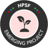
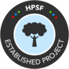
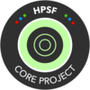

# High Performance Software Foundation Technical Advisory Council (TAC)

This repo contains materials and process documents for the High Performance Software Foundation TAC.

## Meetings

The HPSF TAC meets bi-weekly and all meetings are open to the public.  To join a TAC meeting, please follow [this link](https://zoom-lfx.platform.linuxfoundation.org/meetings/hpsf?view=week).

## Summary of Project Levels

### Emerging

Emerging projects are projects which the TAC believes are, or have the potential to be, important to the ecosystem of Technical Projects or the High Performance Software Foundation ecosystem as a whole. The Emerging stage provides a beneficial, neutral home for these projects. The Emerging stage is intended as a low barrier of entry to the HPSF, which fosters collaborative development and provides a path to deeper alignment with other HPSF projects via the graduation process.

### Established

The Established Stage is for projects that are major components of the High Performance Computing software ecosystem. Established Stage projects will receive mentorship from the TAC and are expected to actively develop their community of contributors, governance, project documentation, and other variables that factor into broad success and adoption.

In order to support their active development, projects in the Established stage have a higher level of access to foundation resources. Projects will participate in the Periodic Review Process.

### Core

The Core Stage is for projects that are on a sustaining cycle of development, maintenance, and long-term support. Core Stage projects are used commonly in production environments and have large, well-established project communities. Projects in the Core stage have a higher level of access to foundation resources. Projects will participate in the Periodic Review Process.

### Emeritus

Emeritus projects are projects which the maintainers feel have reached or are nearing end-of-life. Emeritus projects have contributed to the ecosystem, but are not recommended for modern development except in unusual circumstances, as other options are preferable. The Foundation appreciates the contributions of these projects and their communities, and the role they have played in moving the ecosystem forward.

## TAC Leadership

### Chairperson

* Bill Hoffman

### Maintainers

* Justin LaPolla
* Todd Gamblin

### Voting Members

* Andrew Myers (AMReX)
* Axel Huebl (WarpX)
* Curtis Ober (Trilinos)
* Damien Lebrun-Grandie (Kokkos)
* Gregory Becker (Spack)
* Gregory Kurtzer (Apptainer)
* Matt Koop (Amazon Web Services)
* James Willenbring (Sandia National Laboratory)
* John Mellor-Crummey (HPCToolkit)
* Justin LaPolla (Hewlett Packard Enterprise Development LP)
* Kenneth Moreland (Viskores)
* Reid Priedhorsky (Charliecloud)
* Sameer Shende (E4S)
* Todd Gamblin (Lawrence Livermore National Laboratory)
